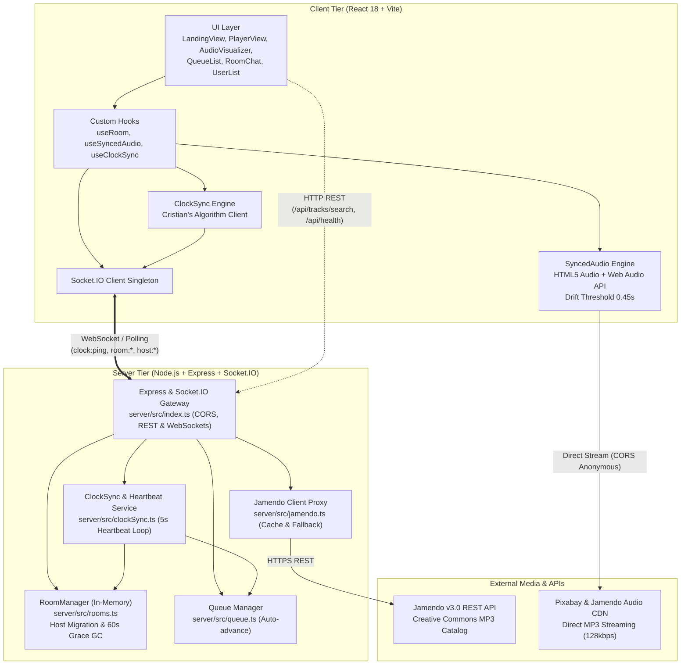
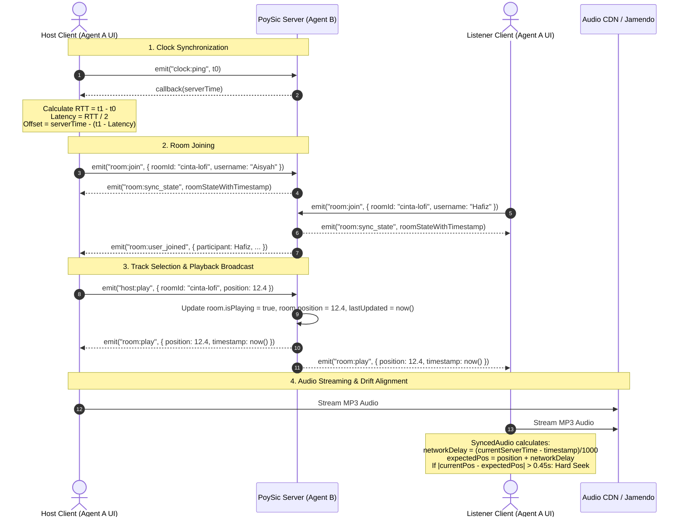
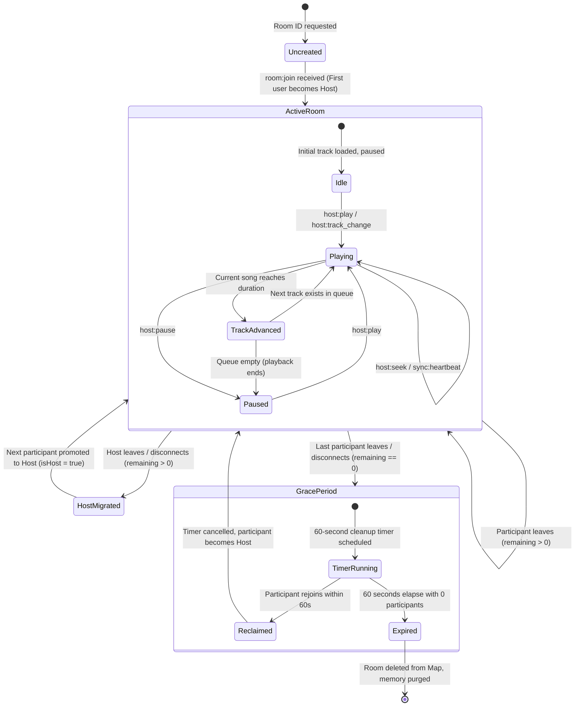

# PoySic — System Architecture & Modular Design

PoySic is a real-time synchronized web-based music player designed for couples, friends, and families to listen to music together across distances with sub-second synchronization, zero advertisements, and zero surveillance tracking.

---

## 1. System Topography & Network Flow

The PoySic system is divided into two primary runtime tiers and external Creative Commons audio sources:

---

## 2. End-to-End Dataflow & Synchronization Sequences

### 2.1 Room Creation, Clock Synchronization & Playback Broadcast

---

## 3. Room Lifecycle State Machine

Rooms are maintained in an ephemeral, memory-only key-value store (`Map<string, RoomState>`). To prevent memory leaks without requiring persistent databases, a graceful garbage-collection state machine manages empty rooms:

---

## 4. Modular Component Responsibilities

### 4.1 Client Architecture (`client/src/`)

| Module / File | Responsibility |
|---|---|
| **`components/player/AudioVisualizer.tsx`** | Canvas-based audio frequency visualizer. Uses `Web Audio API` (`AnalyserNode`) with fallback trigonometric waveforms when browser audio context is suspended. Supports waveform, bar, and radial visualizations. |
| **`components/player/Controls.tsx`** | Playback control deck: Play, Pause, Previous, Next, Seek slider, Volume, Mute toggle, and status badges. |
| **`components/player/ProgressBar.tsx`** | Scrubber bar reflecting playback position and buffered progress with smooth scrubbing gestures. |
| **`components/queue/QueueList.tsx`** | Up-next playlist view with drag/remove controls and track duration indicators. |
| **`components/room/RoomChat.tsx`** | Real-time chat feed with auto-scrolling, system join/leave notices, and instant input delivery. |
| **`components/room/UserList.tsx`** | Active participant roster highlighting room host, join times, and emoji avatars. |
| **`components/ui/Navbar.tsx`** | Global header with connection status indicator, room badge, profile editor, and docs modal trigger. |
| **`components/ui/TrackSearch.tsx`** | Instant search bar querying Jamendo Creative Commons music with audio previews and "Tambah ke Giliran" (Add to Queue) buttons. |
| **`components/ui/LandingView.tsx`** | Room creation and joining landing page with suggested vibe tags and alias avatar selection. |
| **`components/ui/PlayerView.tsx`** | Main room listening dashboard orchestrating vinyl animations, controls, visualizers, and sidebar tabs. |
| **`components/ui/DocsModal.tsx`** | Embedded modal presenting architecture, sync engine rules, and privacy assurances to end users. |
| **`components/ui/DonationModal.tsx`** | Voluntary community donation modal linking to Saweria / Ko-fi. |
| **`lib/audio.ts` (`SyncedAudio`)** | High-level HTML5 Audio wrapper. Configures anonymous CORS, binds Web Audio API analyser, detects browser autoplay blocks, and executes $0.45\text{s}$ drift correction. |
| **`lib/sync.ts` (`ClockSync`)** | Cristian's algorithm client. Fires rapid initial pings (0s, 1s, 3s) followed by periodic 8-second cycles to calculate RTT, latency, and server clock offset. |
| **`lib/socket.ts` (`SocketClient`)** | Singleton Socket.IO connection manager configured with automated reconnects and fallback transports (`polling`, `websocket`). |
| **`hooks/useClockSync.ts`** | React hook encapsulating `ClockSync` lifecycle and reactive latency/offset state. |
| **`hooks/useSyncedAudio.ts`** | React hook managing `SyncedAudio` state, duration, volume, and playback callbacks. |
| **`hooks/useRoom.ts`** | Primary communication hook binding Socket.IO inbound/outbound events, presence roster, and chat messages. |
| **`types/`** | Strongly typed TypeScript contracts for tracks, rooms, sync stats, audio callbacks, and socket payloads. |

### 4.2 Server Architecture (`server/src/`)

| Module / File | Responsibility |
|---|---|
| **`index.ts`** | Express application and HTTP server bootstrapper. Configures CORS, sets up Socket.IO event router, serves static assets in production, and binds signal handlers (`SIGINT`/`SIGTERM`) for graceful shutdowns. |
| **`rooms.ts` (`RoomManager`)** | Manages room instances (`Map<string, RoomState>`), participant joins/leaves, host migration, profile updates, and the 60-second empty-room cleanup timer. |
| **`clockSync.ts`** | Handles immediate `clock:ping` responses, sanitizes numeric playback positions, calculates elapsed track times, and runs the 5-second `sync:heartbeat` loop. |
| **`queue.ts`** | Handles track queue mutations: deduplicating additions (`addToQueue`), removing tracks (`removeFromQueue`), clearing queues (`clearQueue`), and auto-advancing (`advanceTrack`). |
| **`jamendo.ts`** | Native HTTPS client for Jamendo API v3.0 queries. Parses track metadata, duration, cover art, and Creative Commons licenses, with an offline-capable fallback catalog. |
| **`types.ts`** | Authoritative shared TypeScript interfaces for tracks, participants, room state, chat messages, and all inbound/outbound Socket.IO payload schemas. |

---

## 5. Security, Resilience & Privacy Architecture

1. **Zero Persistent Storage / Zero KYC:**
   - PoySic requires no account registration, passwords, or persistent database records.
   - All room states, participant lists, and chat logs reside in RAM and disappear automatically when rooms close.
2. **Prototype Pollution Protection:**
   - Express REST route `/api/rooms/:id` sanitizes user input and explicitly rejects reserved property names (`__proto__`, `constructor`, `prototype`) with an HTTP 404 response.
3. **Input Sanitization & Bounds Checking:**
   - All string payloads (chat messages, usernames, search queries) are trimmed and length-bounded.
   - Playback positions are clamped to valid positive numbers and bounded by the track's duration via `sanitizePosition`.
4. **Graceful Degradation:**
   - If Jamendo API queries fail or encounter network timeouts, search and curated endpoints immediately fall back to high-quality Creative Commons fallback tracks without throwing 500 errors.
5. **Autoplay Policy Resilience:**
   - Modern browsers block unmuted audio playback unless triggered by user interaction. `SyncedAudio` catches `NotAllowedError` and triggers an intuitive UI notification allowing users to resume playback with one tap.
