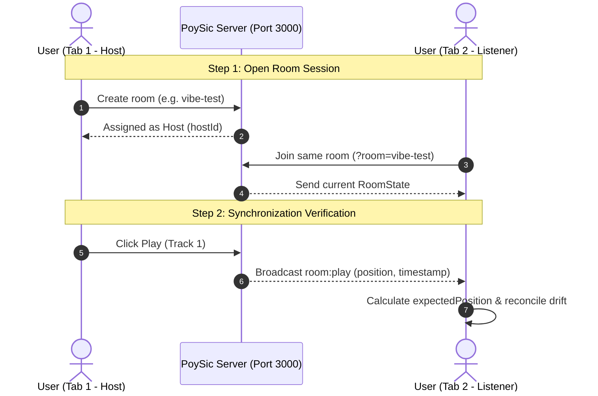

# 2-Tab Synchronization Testing Guide (`docs/TESTING.md`)

> Step-by-step guide to verify PoySic's real-time audio synchronization precision (Clock Sync & Drift Correction) between two concurrent browser tabs.

---

## 1. Prerequisites

Ensure both PoySic servers are running in your terminal:
1. **Backend Server:** `http://localhost:3000` (or `npm run dev:server` from root)
2. **Frontend Client:** `http://localhost:5173` (or `npm run dev:client` from root)

---

## 2. Step-by-Step 2-Tab Test Flow



### Step 1: Setup Tab 1 (Room Host)
1. Open your web browser (e.g. Chrome) and navigate to:
   ```
   http://localhost:5173
   ```
2. Open **Developer Tools / Console** by pressing `F12` (or `Ctrl + Shift + I`), then select the **Console** tab.
3. On the PoySic home page, click **"CREATE INSTANT ROOM"** (or enter a room slug like `test-sync-1`).
4. You are now in the player view as the **Host**. Note the room code (e.g., `vibe-xxxx` or see the URL address bar: `http://localhost:5173/?room=vibe-xxxx`).

---

### Step 2: Setup Tab 2 (Listener)
1. Open a **New Tab** in the same browser (or an *Incognito* window / another browser like Edge or Firefox).
2. Open **Developer Tools / Console** (`F12`) in Tab 2 as well.
3. Navigate to the same room URL:
   ```
   http://localhost:5173/?room=YOUR_ROOM_CODE
   ```
4. Enter a nickname (e.g., `Listener 2`) and choose an avatar icon.
5. Observe the participant list in both tabs:
   - Tab 1 shows 2 participants (Host & Listener 2).
   - Tab 2 displays the Host badge on Tab 1's user.

---

### Step 3: Audio Action Verification & Console Logs

Perform the following test actions in Tab 1 (Host) and observe the reaction in Tab 2:

| # | Host Action (Tab 1) | Expected in Tab 2 (Listener) | Console Log to Verify |
|:--:|---|---|---|
| **1** | Click **Play** | Audio starts playing simultaneously in Tab 2. Vinyl disc spins. | Tab 2: `[SyncedAudio] Playing at position X.XXs` |
| **2** | Click **Pause** | Audio pauses immediately in Tab 2 at the exact same position. | Tab 2: `[SyncedAudio] Paused at position X.XXs` |
| **3** | Scrub **Seek Bar** (Seek to 01:30) | Audio jumps to the exact second in Tab 2. | Tab 2: `[SyncedAudio] Seek to position 90.00s` |
| **4** | Click **Change Track** from search/curated | New track loads and plays synchronously in Tab 2. | Tab 2: `[SyncedAudio] Source changed to: ...` |
| **5** | Let track end (or seek 5 seconds before end) | When track finishes, auto-advance plays the next song in the queue (`queue[0]`). | Tab 2: Plays next song seamlessly (*preloaded*). |

---

### Step 4: Drift Correction Test (Lag Simulation)

This test verifies that Cristian's engine & `SyncedAudio` automatically reconcile audio if a listener's tab throttles or sleeps:

1. In **Tab 2**, minimize the browser window or switch to another tab for 10–15 seconds while music is playing in Tab 1.
2. Return to **Tab 2**:
   - If tab throttling caused playback to lag by more than **450ms (0.45s)**, PoySic will automatically trigger a *hard seek* to lock back into step with the Host.
3. Check the console log in Tab 2:
   ```
   [SyncedAudio] Drift corrected: 0.820s (Current: 45.10s -> Expected: 45.92s)
   ```
4. The drift indicator in the Player UI displays the drift in milliseconds:
   - **Green (< 450ms):** Audio is within the smooth tolerance zone.
   - **Amber / Pulse (> 450ms):** Drift detected and auto-correction executed.

---

### Step 5: Troubleshooting & Reporting

If audio is out of sync or drift is not reconciled:
1. Copy the output from the browser console (specifically logs prefixed with `[SyncedAudio]` and `[ClockSync]`).
2. Note the **RTT Latency** and **Clock Offset** displayed in the room technical telemetry card.
3. Check network stability or adjust the `driftThreshold` parameter if needed.
