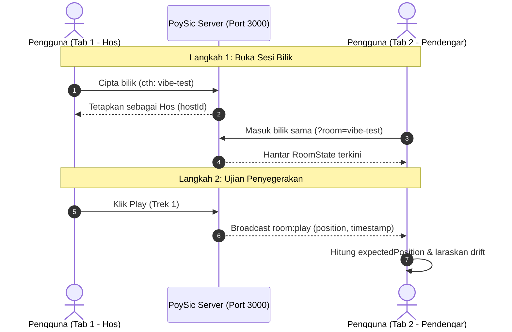

# Panduan Ujian Sinkronisasi 2-Tab (docs/TESTING.md)

> Panduan langkah demi langkah untuk menguji ketepatan penyegerakan audio (Clock Sync & Drift Correction) PoySic antara dua tab pelayar secara serentak.

---

## 1. Prasyarat

Pastikan kedua-dua pelayan PoySic sedang berjalan di terminal anda:
1. **Backend Server:** `http://localhost:3000` (atau `npm run dev:server` dari root)
2. **Frontend Client:** `http://localhost:5173` (atau `npm run dev:client` dari root)

---

## 2. Langkah Demi Langkah Ujian 2-Tab



### Langkah 1: Sediakan Tab 1 (Hos Bilik)
1. Buka pelayar web (contohnya Chrome) dan layari:
   ```
   http://localhost:5173
   ```
2. Buka **Developer Tools / Console** dengan menekan `F12` (atau `Ctrl + Shift + I`), pilih tab **Console**.
3. Di halaman utama PoySic, klik butang **"CIPTA BILIK SEGERA"** (atau masukkan slug bilik seperti `test-sync-1`).
4. Anda kini berada di paparan bilik sebagai **Hos**. Catat kod bilik (contohnya `vibe-xxxx` atau rujuk URL di address bar: `http://localhost:5173/?room=vibe-xxxx`).

---

### Langkah 2: Sediakan Tab 2 (Pendengar / Listener)
1. Buka **Tab Baru** dalam pelayar yang sama (atau tetingkap *Incognito* / pelayar lain seperti Edge/Firefox).
2. Buka **Developer Tools / Console** (`F12`) di Tab 2 juga.
3. Layari URL bilik yang sama:
   ```
   http://localhost:5173/?room=KOD_BILIK_ANDA
   ```
4. Masukkan nama samaran berbeza (cth: `Pendengar 2`) dan pilih avatar.
5. Perhatikan senarai peserta di kedua-dua tab:
   - Tab 1 memaparkan 2 peserta (Hos & Pendengar 2).
   - Tab 2 memaparkan lencana Hos pada nama Tab 1.

---

### Langkah 3: Ujian Tindakan Audio & Pengesahan Console

Jalankan senario ujian berikut di Tab 1 (Hos) dan perhatikan tindak balas di Tab 2:

| No | Tindakan Hos (Tab 1) | Jangkaan di Tab 2 (Pendengar) | Log Console yang Perlu Disemak |
|:--:|---|---|---|
| **1** | Klik **Play** | Audio mula bermain serentak di Tab 2. Piring vinyl berpusing. | Tab 2: `[SyncedAudio] Playing at position X.XXs` |
| **2** | Klik **Pause** | Audio berhenti serta-merta di Tab 2 pada kedudukan yang sama. | Tab 2: `[SyncedAudio] Paused at position X.XXs` |
| **3** | Tarik **Scrubbing Bar** (Seek ke 01:30) | Audio melompat ke saat yang sama di Tab 2. | Tab 2: `[SyncedAudio] Seek to position 90.00s` |
| **4** | Klik **Tukar Lagu** dari carian/curated | Lagu baru dimuat dan dimainkan secara serentak di Tab 2. | Tab 2: `[SyncedAudio] Source changed to: ...` |
| **5** | Biarkan lagu tamat (atau seek ke 5 saat sebelum tamat) | Apabila lagu tamat, auto-advance memainkan lagu seterusnya dalam giliran (`queue[0]`). | Tab 2: Memainkan lagu seterusnya tanpa jeda (*preloaded*). |

---

### Langkah 4: Ujian Drift Correction (Simulasi Kelewatan)

Ujian ini memastikan enjin Cristian & `SyncedAudio` membetulkan audio secara automatik jika tab pengguna tertidur:

1. Di **Tab 2**, kecilkan tetingkap (*minimize*) atau tukar ke tab lain selama 10–15 saat semasa muzik sedang dimainkan di Tab 1.
2. Buka semula **Tab 2**:
   - Jika tab tertidur menyebabkan kelewatan melebihi **450ms (0.45s)**, PoySic akan secara automatik menjalankan *hard seek* untuk menyelaraskan audio dengan Hos.
3. Semak log console di Tab 2:
   ```
   [SyncedAudio] Drift corrected: 0.820s (Current: 45.10s -> Expected: 45.92s)
   ```
4. Indikator di Player UI akan memaparkan bacaan drift dalam milisaat:
   - **Hijau (< 450ms):** Audio berada dalam zon toleransi lancar.
   - **Merah / Pulse (> 450ms):** Drift dikesan dan pembetulan automatik sedang/telah dijalankan.

---

### Langkah 5: Pelaporan Jika Menemui Masalah

Sekiranya audio tidak segerak atau drift tidak dibetulkan:
1. Salin teks daripada console pelayar (khususnya log bertanda `[SyncedAudio]` dan `[ClockSync]`).
2. Catat bacaan **RTT Latency** dan **Offset** yang dipaparkan pada kad spesifikasi teknikal bilik.
3. Laporkan isu tersebut untuk pelarasan pemalar `driftThreshold` atau selang `heartbeat`.
